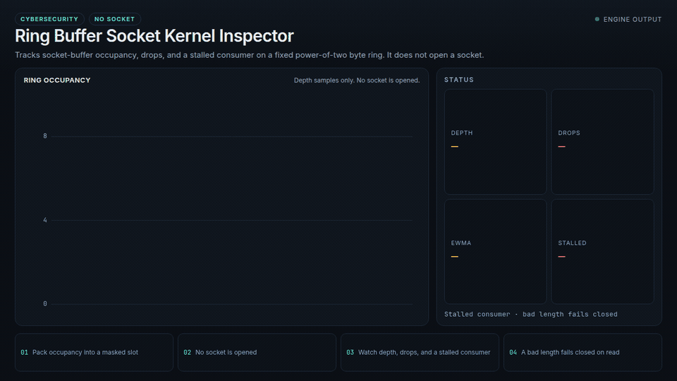
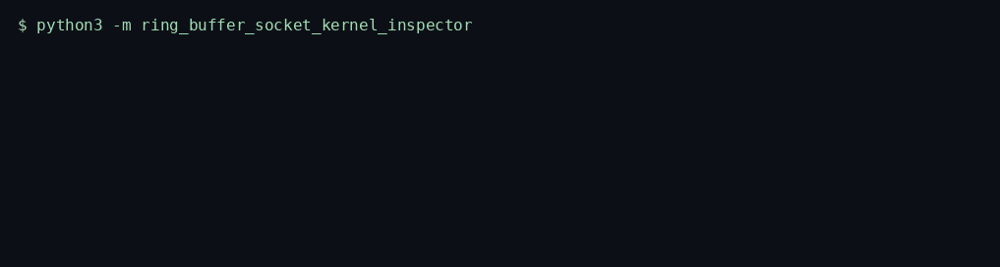
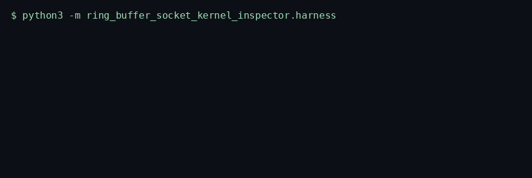
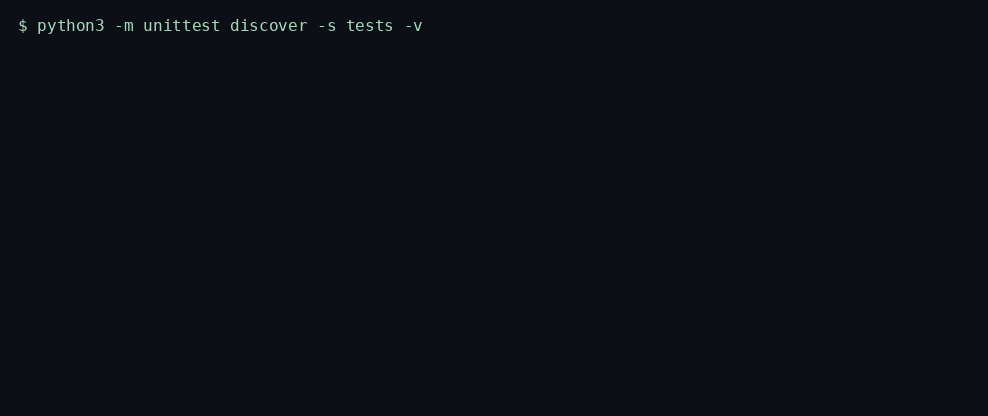

# Ring Buffer Socket Kernel Inspector

> Tracks socket-buffer occupancy, drops, and a stalled consumer on a fixed power-of-two byte ring. It does not open a socket.

<p>
  <a href="https://github.com/TechieGoku2623/ring-buffer-socket-kernel-inspector/actions/workflows/ci.yml"></a>
  
  
</p>

| | |
| --- | --- |
| **Website** | https://github.com/TechieGoku2623/ring-buffer-socket-kernel-inspector |
| **Topics** | `python` `asyncio` `cybersecurity` `observability` `ring-buffer` `sockets` |

## Watch the demo

<p align="center">
  
</p>

Play the video: [docs/watch.html](docs/watch.html)

## The problem this solves

Drops and a stalled consumer are how a socket path fails under load. Inspecting that failure by opening the wire is the wrong permission and the wrong tool.

Ring Buffer Socket Kernel Inspector models the path as a power-of-two byte ring with mask indexing, tracks drops with an exponentially weighted moving average, and flags a stall when the consumer stops draining. The report is depth, drop count, the smoothed drop rate, and a stall bit, on `sec.sock.ring`.

It is a userspace observability model of buffer health. The repository contains no packet crafting and no kernel write. The posture is defensive.

## Walkthrough

### How it works


One real batch, in order: what went in, which gate fired, what came out.

Three recordings from this repository. Each one is the command in the frame, not a drawing.

### Engine

`python3 -m ring_buffer_socket_kernel_inspector`



Near-capacity, a rising drop counter, and a consumer that stops advancing are warnings. A damaged length field raises on read.

### Benchmark

`python3 -m ring_buffer_socket_kernel_inspector.harness`



5000 publish-and-consume iterations, seed 20261002. The frame ends on the status line and `echo $?`.

### Tests

`python3 -m unittest discover -s tests -v`



Wire round-trip, the happy path, and both edge cases below.

## Pipeline

```
occupancy sample
  |
  v
pack into bytearray[index & mask]
  |
  +--> depth >= 90% --------> near capacity
  +--> drops rising ---------> EWMA warning
  +--> consumer idle --------> stalled
  v
{depth, drops, ewma_drop, stalled, rejected}
```

## Quick start

```bash
python3 -m venv venv
source venv/bin/activate
pip install -e ".[dev]"
python -m ring_buffer_socket_kernel_inspector
python -m ring_buffer_socket_kernel_inspector.harness
python -m unittest discover -s tests -v
```

Python 3.12. The runtime is the standard library. `black` and `flake8` are the `dev` extra.

## Use it

```python
import asyncio

from ring_buffer_socket_kernel_inspector import RingBufferSocketKernelInspector


async def demo() -> None:
    engine = RingBufferSocketKernelInspector(capacity=16, stall_records=4)
    result = await engine.run(
        [
            {
                "queue_depth": 12,
                "drops": index,
                "rmem_alloc": 4096,
                "wmem_alloc": 2048,
                "state": 1,
                "sequence": index + 1,
            }
            for index in range(6)
        ]
    )
    print(result)


asyncio.run(demo())
```

## Bounds

| | |
| --- | ---: |
| Iterations | 5000 |
| Average | 20.731 µs |
| P99 | 52.839 µs |
| tracemalloc peak | 171161 bytes |

Figures are from the harness on the machine that published them. A later host moves the microseconds. The pass/fail result does not.

## What it refuses

- A length field that is not the struct width raises `EngineKernelException` on the next consume.
- Head and tail wrap through `capacity - 1`. Records stay intact across the mask.

SOC 2 monitoring of security telemetry. No `CAP_NET_RAW`, no packet crafting, no kernel calls.

## Tree

```
src/ring_buffer_socket_kernel_inspector/
  engine.py       kernel
  wire.py         struct frames
  harness.py      benchmark
  __main__.py     demo entry
tests/test_engine.py
Dockerfile        non-root, uid 10001
```
